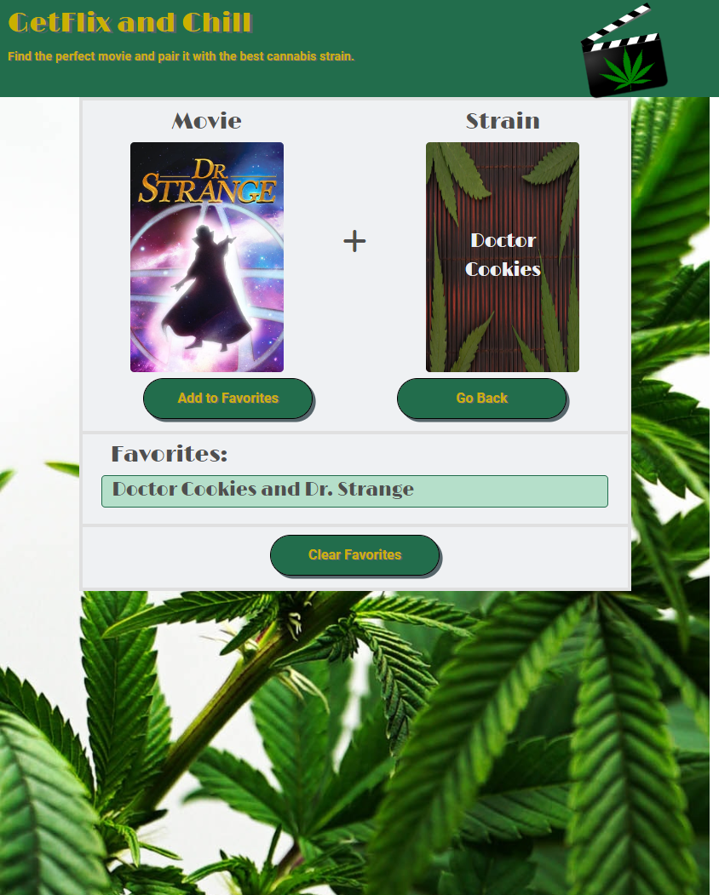

# GetFlix and Chill

The purpose of this app is to create a page that will pair a randomized movie with a cannabis strain. You will be able to select the genre of movie you would like to see as well as the average critic rating. You can save favorite pairings to localStorage. Users must be 21 or older. 

## Screenshots

(<a href="#top">back to top</a>)

## Built With

* HTML
* CSS
* JavaScript
* jQuery
* MD Bootstrap

## Contributors 

* David Lundt
* Lauren Lacourciere
* Kevin Fries
* Rachel Spears

(<a href="#top">back to top</a>)

## Acknowledgements 

* Rapid API
* Advance Movie Search API
* Otreeba Open Cannabis API
* FontAwesome

## Website URL
https://apatheticjedi.github.io/get-flix-and-chill/

(<a href="#top">back to top</a>)
